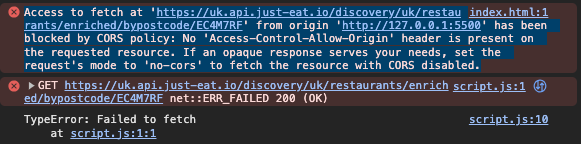

# JET Restaurant Data

## Overview
I am thrilled to share with you an exciting opportunity I've been given as part of the JET Early Careers Software Engineer program. Ahead of the assessment day, I've been entrusted with an engaging coding exercise that promises to ignite my passion for problem-solving and innovation.

Let's dive right into the challenge provided:

**The Problem**: We are looking for you to find restaurant data and return this in an interface of your choice.
Using the API provided you will need to send a postcode to return a set of data, you’ll need to filter this data to focus just on the restaurant data.
You will notice that a lot of data is returned in the ‘restaurant object’ (and in the whole response!), we’re only interested in the following pieces of data being returned:

- Name
- Cuisines
- Rating - as a number
- Address

**The Brief**: We would like you to display these four data points in any way of your choosing, this could be: a web interface, console application, or anything you like.
Regardless of interface we’d like you to limit your shown data to the first 10 restaurants returned, we’re more interested in how you display each one rather than a huge list of data.
Please upload your completed solution to Github (bonus points if we can see git history!).

## Interface Used
I have opted to showcase these four data points through the terminal interface. With this choice, I aim to leverage the simplicity and efficiency of the command-line environment to present the information in a clear and accessible manner. Get ready to dive into the data directly from your terminal!

## How to build, compile and run solution
### Clone my Repo from Github
To clone a repository from GitHub to your local machine, follow these steps:
1. #### Navigate to Repository Page:
    - Go to GitHub.com and navigate to the main page of the repository you want to clone.
2. #### Get Repository URL  
    - Above the list of files, click on the Code button.
    - Copy the URL for the repository.
3. #### Open Terminal:
    - Open your Terminal or command-line interface.
4. #### Change Directory:
    - Change the current working directory in your Terminal to the location where you want the cloned repository to be saved.
5. #### Clone Repository:
    - In the Terminal, use the `git clone` command followed by the repository URL you copied earlier:

```git clone https://github.com/YOUR-USERNAME/YOUR-REPOSITORY```
6. #### Press Enter:
    - Press Enter to execute the git clone command.
7. #### Access Cloned Repository:
    - Once the cloning process is complete, you can access the cloned repository in the specified directory on your local machine.

#### Run Solution
1. Open your terminal.
2. Navigate to the directory containing the axios.js file.
3. Type the following command and press Enter: `node axios.js`.
4. The terminal will display information about the first 10 restaurants, including four data points for each:
    - Name
    - Cuisines
    - Rating (as a number)
    - Address
5. To view another set of 10 restaurants with the same four data points, change the API endpoint to a different postcode in the axios.js file and repeat step 3.

### Uncertainties and Assumptions:


I had issues with requesting data from the API using fetch. As fetch represents data via web browser, I encountered a challenge related to Cross-Origin Resource Sharing (CORS) blocking. I initially struggled with this issue, I thought of all types of ways I could bypass this. I eventually contacted JET to inquire whether this is an expected part of the assesment  or if it may be indicative of an unintended issue. I was thinking it's possible I missed instructions on how to navigate the API.

After hours of research reading documentation and stack overflow, I later find out I could use the axios library to get the data.
### Future Improvement


